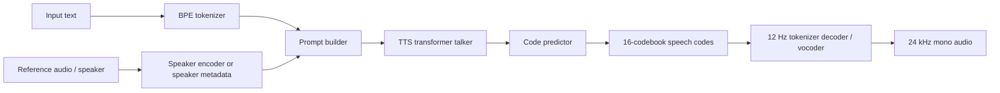

# qwen3-tts.cpp

C++17 / GGML inference for [Qwen3-TTS](https://huggingface.co/Qwen), with a
complete text-to-speech pipeline: text tokenization, speaker embedding,
autoregressive speech-code generation, and 24 kHz vocoder decoding without
Python or PyTorch at inference time.

This fork has grown into a more complete runtime around the original
[`predict-woo/qwen3-tts.cpp`](https://github.com/predict-woo/qwen3-tts.cpp)
project. It keeps the original goal - practical local Qwen3-TTS inference in
C++ - and adds broader model support, native APIs, Windows/CUDA tooling,
regression tests, debugging utilities, and a much faster 1.7B/vocoder path.


## Highlights

- Full Qwen3-TTS pipeline in C++17 on top of GGML
- No Python dependency at runtime
- Qwen3-TTS 0.6B and 1.7B GGUF conversion scripts
- 1.7B Base and 1.7B CustomVoice support
- Voice cloning from reference WAVs
- Reusable speaker embeddings (`.json` or raw float32 `.bin`)
- Named speakers and style/instruction prompts for CustomVoice models
- Optional ICL voice cloning inputs: reference text, reference token IDs, and reference speech codes
- Greedy and sampled decoding with temperature, top-k, repetition penalty, and an exposed top-p parameter
- Multilingual language selection: `en`, `ru`, `zh`, `ja`, `ko`, `de`, `fr`, `es`, `it`, `pt`
- GGUF transformer quantization for selected matrix weights, including Q8_0 and K-quant variants
- CUDA, Metal/CoreML, accelerator, and CPU fallback paths through GGML backends
- Native C++ API, C ABI, optional JNI bridge, and Kotlin Multiplatform wrappers
- Regression tests, Python reference comparison tools, trace dumps, WAV validation, and benchmark scripts
- Detailed generation and vocoder timing instrumentation when built with `QWEN3_TTS_TIMING=ON`

## Quick Start

### Windows

```powershell
git clone https://github.com/Danmoreng/qwen3-tts.cpp.git
cd qwen3-tts.cpp
git submodule update --init --recursive

# Build the CLI. Add -EnableCuda when GGML CUDA is available.
.\build.ps1 -UseNinja -EnableCuda -Configuration Release

# Create a Python environment for setup/conversion only.
uv venv .venv
.\.venv\Scripts\Activate.ps1
uv pip install --upgrade pip
uv pip install huggingface_hub gguf torch safetensors numpy tqdm coremltools

# Download and convert model artifacts.
python scripts\setup_pipeline_models.py

# Synthesize.
.\build\qwen3-tts-cli.exe -m models `
  -t "Hello from qwen3-tts.cpp running locally." `
  -o examples\hello.wav
```

### macOS / Linux

```bash
git clone https://github.com/Danmoreng/qwen3-tts.cpp.git
cd qwen3-tts.cpp
git submodule update --init --recursive

cmake -S . -B build -DCMAKE_BUILD_TYPE=Release
cmake --build build -j

uv venv .venv
source .venv/bin/activate
uv pip install --upgrade pip
uv pip install huggingface_hub gguf torch safetensors numpy tqdm coremltools

python scripts/setup_pipeline_models.py

./build/qwen3-tts-cli \
  -m models \
  -t "Hello from qwen3-tts.cpp running locally." \
  -o examples/hello.wav
```

On macOS, CoreML code-predictor support is enabled when
`models/coreml/code_predictor.mlpackage` exists. Set `QWEN3_TTS_USE_COREML=0` to
disable it.

## Model Setup

For the default 0.6B pipeline:

```bash
python scripts/setup_pipeline_models.py
```

For 1.7B Base and 1.7B CustomVoice:

```bash
python scripts/setup_1.7b_model.py
```

Useful setup flags:

| Flag | Purpose |
|------|---------|
| `--force` | Re-download and regenerate artifacts |
| `--skip-download` | Use already downloaded Hugging Face model directories |
| `--coreml auto|on|off` | Control macOS CoreML export behavior |

Typical generated files:

| File | Purpose |
|------|---------|
| `models/qwen3-tts-0.6b-f16.gguf` | 0.6B TTS transformer |
| `models/qwen3-tts-tokenizer-f16.gguf` | 12 Hz speech tokenizer / vocoder |
| `models/qwen3-tts-1.7b-base-f16.gguf` | 1.7B Base transformer |
| `models/qwen3-tts-1.7b-customvoice-f16.gguf` | 1.7B CustomVoice transformer |
| `models/coreml/code_predictor.mlpackage` | Optional macOS CoreML code predictor |

Manual conversion is still available:

```bash
huggingface-cli download Qwen/Qwen3-TTS-12Hz-0.6B-Base \
  --local-dir models/Qwen3-TTS-12Hz-0.6B-Base

python scripts/convert_tts_to_gguf.py \
  models/Qwen3-TTS-12Hz-0.6B-Base \
  models/qwen3-tts-0.6b-f16.gguf

python scripts/convert_tokenizer_to_gguf.py \
  models/Qwen3-TTS-12Hz-0.6B-Base \
  models/qwen3-tts-tokenizer-f16.gguf
```

Quantize a converted model with the native tool:

```bash
./build/qwen3-tts-quantize \
  models/qwen3-tts-0.6b-f16.gguf \
  models/qwen3-tts-0.6b-q4_k_m.gguf \
  q4_k_m
```

Supported output policies include `bf16`, `q8_0`, `q4_k`, `q4_k_m`,
`q5_k_m`, `q6_k`, and the lower-bit K-quant variants. The `*_k_m`
variants use a mixed policy similar to llama.cpp-style quantization:
most transformer matrices use the base K-quant type, while selected
attention value and FFN down-projection matrices are kept at a higher
precision. Audio-critical tokenizer/vocoder weights and embedding lookup
tables are intentionally left in their source precision.

## Usage

```bash
# Basic synthesis
./build/qwen3-tts-cli -m models -t "Hello, world!" -o hello.wav

# Voice cloning from reference audio
./build/qwen3-tts-cli -m models -r reference.wav \
  -t "This should follow the reference voice." -o cloned.wav

# Save a speaker embedding and reuse it without re-encoding audio
./build/qwen3-tts-cli -m models -r reference.wav \
  --dump-speaker-embedding speaker.json \
  -t "First pass." -o cloned_once.wav

./build/qwen3-tts-cli -m models --speaker-embedding speaker.json \
  -t "Second pass using the saved embedding." -o cloned_reuse.wav

# 1.7B Base
./build/qwen3-tts-cli -m models --model-name qwen3-tts-1.7b-base-f16.gguf \
  -t "The 1.7B base model is running in C++." -o base_1p7b.wav

# 1.7B CustomVoice with named speaker and style instruction
./build/qwen3-tts-cli -m models --model-name qwen3-tts-1.7b-customvoice-f16.gguf \
  --speaker vivian \
  --instruct "Whispering, very soft and quiet voice." \
  -t "This is a styled CustomVoice example." \
  -o styled.wav

# Deterministic-ish greedy run
./build/qwen3-tts-cli -m models -t "Hello!" \
  --temperature 0 --top-k 0 --max-tokens 256 -o greedy.wav
```

Example voice-clone files included in this repository:

- [Input reference WAV](./examples/readme_clone_input.wav)
- [Generated clone example](./examples/readme_example_clone.wav)

<audio controls src="./examples/readme_clone_input.wav"></audio>
<br/>
<audio controls src="./examples/readme_example_clone.wav"></audio>

### CLI Options

| Flag | Description | Default |
|------|-------------|---------|
| `-m, --model <dir>` | Directory containing GGUF model files | Required |
| `--model-name <file>` | Select a specific TTS GGUF in `--model` | Auto-detect |
| `-t, --text <text>` | Text to synthesize | Required |
| `-o, --output <file>` | Output WAV path | `output.wav` |
| `-r, --reference <file>` | Reference WAV for voice cloning | None |
| `--reference-text <text>` | Transcript for ICL voice cloning | None |
| `--reference-text-file <file>` | Read ICL transcript from a file | None |
| `--reference-token-ids <file>` | Reference prompt token IDs | None |
| `--reference-codes <file>` | Reference speech codes as text or JSON integers | None |
| `--speaker <name>` | Named CustomVoice speaker | None |
| `--speaker-embedding <file>` | Reuse saved speaker embedding | None |
| `--dump-speaker-embedding <file>` | Save embedding extracted from `--reference` | None |
| `--dump-generated-codes <file>` | Save generated speech codes | None |
| `--dump-decoder-codes <file>` | Save vocoder-input speech codes | None |
| `--temperature <value>` | Sampling temperature; `0` means greedy | `0.9` |
| `--top-k <n>` | Top-k sampling; `0` disables it | `50` |
| `--top-p <value>` | Exposed top-p sampling parameter | `1.0` |
| `--max-tokens <n>` | Maximum generated audio frames | `4096` |
| `--repeat <n>` | Repeat synthesis in one loaded process | `1` |
| `--repetition-penalty <value>` | Codebook-0 repetition penalty | `1.05` |
| `-l, --language <lang>` | `en ru zh ja ko de fr es it pt` | `en` |
| `--instruction`, `--instruct` | Style / voice instruction prompt | None |
| `-j, --threads <n>` | CPU thread count | `4` |

`--reference`, `--speaker`, and `--speaker-embedding` are mutually exclusive
speaker-conditioning modes.

## Performance

Benchmarks depend heavily on backend, GPU, model dtype, prompt length, sampling
settings, and whether the first run includes graph setup. Treat these as
reference points, not universal guarantees.

### 0.6B PyTorch vs C++

From `docs/benchmark_pytorch_vs_cpp.json`, measured on Darwin/ARM against the
Python reference pipeline:

| Scenario | Python | qwen3-tts.cpp | Speedup | Peak RSS difference |
|----------|--------|---------------|---------|---------------------|
| Basic TTS | 55.66 s | 17.45 s | 3.19x | 19.0% lower |
| Voice clone | 83.58 s | 20.52 s | 4.07x | 7.7% lower |

Reproduce with:

```powershell
.\scripts\benchmark_python_vs_cpp.ps1 -Deterministic
```

### 1.7B Q8 CUDA Timing

Local Windows timing run, 64 frames / 5.12 seconds of audio, Q8 1.7B model,
CUDA build with timing enabled:

| System | Model | Generate | Vocoder | Total | Throughput |
|--------|-------|----------|---------|-------|------------|
| Ryzen 9 9955HX3D, RTX 5080 Laptop GPU 16 GB | 1.7B Q8 | 865 ms | 82 ms | 948 ms | 5.40x realtime |

The latest vocoder optimization changed the 64-frame decoder path from
`489 ms` to `82 ms` by replacing slow `ggml_conv_transpose_1d` usage with a
pre-permuted `mul_mat + ggml_col2im_1d` path. The output is exactly
`122880` samples for 64 frames.

For comparison during the investigation, another implementation measured
`64.5 ms` for its codec decode on the same 64-frame workload, so the remaining
gap is now small and likely lives in residual conv/layout overhead rather than
the transposed convolutions.

### Benchmark Scripts

| Script | Purpose |
|--------|---------|
| `scripts/benchmark_python_vs_cpp.ps1` | Compare C++ CLI against Python reference |
| `scripts/benchmark_cuda_graphs.ps1` | Compare CUDA graph settings for 1.7B runs |
| `scripts/benchmark_0p6b_f16_cuda.ps1` | CUDA benchmark helper for 0.6B F16 |
| `scripts/wav_stats.ps1` | Validate generated WAV duration, peak, RMS, and silence checks |

## Architecture



Major runtime components:

| Component | Files | Role |
|-----------|-------|------|
| Tokenizer | `src/text_tokenizer.*`, `src/tokenizer_unicode.*` | GGUF BPE tokenization |
| Speaker encoder | `src/audio_tokenizer_encoder.*`, `src/encoder/*` | Reference audio to speaker embedding |
| Speech tokenizer encoder | `src/speech_tokenizer_encoder.*` | Audio to speech codes for ICL/debug workflows |
| Transformer | `src/tts_transformer.*`, `src/transformer/*` | Talker and code-predictor generation |
| Vocoder | `src/audio_tokenizer_decoder.*`, `src/decoder/*` | Speech codes to waveform |
| Pipeline | `src/qwen3_tts.*`, `src/pipeline/*` | End-to-end orchestration, caching, timing |
| CLI | `src/main.cpp` | Command-line frontend |
| C API / JNI | `src/qwen3_tts_c.*`, `src/qwen3_tts_jni.cpp` | Native integration surface |

## Native APIs

The CLI is only one frontend. The project also exposes:

- C++ API: `qwen3_tts::Qwen3TTS` in `src/qwen3_tts.h`
- C ABI: `src/qwen3_tts_c.h`
- Optional JNI shared library with `-DQWEN3_TTS_BUILD_SHARED=ON`
- Kotlin Multiplatform wrappers in `shared/src/*/kotlin/com/qwen/tts/studio/engine/QwenEngine.kt`

The model capability APIs allow frontends to adapt to the loaded model:

- Voice cloning support
- Named speaker support
- Instruction/style prompt support
- Speaker embedding dimension
- Available speaker list

Build the JNI target:

```bash
cmake -S . -B build -DQWEN3_TTS_BUILD_SHARED=ON
cmake --build build -j
```

## Backends

Each model component logs the backend it selected at load time. The runtime uses
the GGML scheduler and prefers accelerated backends when available.

General backend preference:

```text
IGPU -> GPU -> ACCEL -> CPU
```

Common builds:

```powershell
# Windows Visual Studio
.\build.ps1 -Configuration Release

# Windows Ninja + CUDA + timing
.\build.ps1 -UseNinja -EnableCuda -EnableTiming -Configuration Release

# CMake CUDA build
cmake -S . -B build -DQWEN3_TTS_CUDA=ON -DGGML_CUDA=ON
cmake --build build -j

# Timing instrumentation
cmake -S . -B build -DQWEN3_TTS_TIMING=ON
cmake --build build -j
```

Low-memory mode can be enabled with:

```bash
QWEN3_TTS_LOW_MEM=1 ./build/qwen3-tts-cli -m models -t "Hello" -o hello.wav
```

## Testing and Debugging

Run the Windows regression suite:

```powershell
.\scripts\run_all_tests.ps1 -Configuration Release
```

Run the POSIX test runner:

```bash
bash scripts/run_all_tests.sh
```

Useful debugging tools:

| Tool | Purpose |
|------|---------|
| `scripts/prepare_test_assets.ps1` | Generate or refresh deterministic reference assets |
| `scripts/compare_e2e.py` | End-to-end Python vs C++ comparison |
| `scripts/dump_python_trace.py` | Dump Python logits/tokens for frame-level debugging |
| `scripts/debug_trace_report.py` | Compare trace directories |
| `QWEN3_TTS_DEBUG_DUMP_DIR` | Enable C++ frame/code trace dumps |
| `QWEN3_TTS_DEBUG_DUMP_MAX_FRAMES` | Limit dumped generation frames |
| `QWEN3_TTS_DEBUG_DUMP_MAX_CODE_STEPS` | Limit dumped code-predictor steps |

Example trace run:

```powershell
$env:QWEN3_TTS_DEBUG_DUMP_DIR = ".\trace_cpp_1p7"
$env:QWEN3_TTS_DEBUG_DUMP_MAX_FRAMES = "2"
$env:QWEN3_TTS_DEBUG_DUMP_MAX_CODE_STEPS = "15"
.\build\qwen3-tts-cli.exe -m models `
  --model-name qwen3-tts-1.7b-base-f16.gguf `
  -t "Hello." --temperature 0 --top-k 0 --max-tokens 64 -o trace.wav

python .\scripts\debug_trace_report.py --trace-a .\trace_cpp_1p7
```

## Project Status

This repository is actively evolving. The current focus areas are:

- Faster 1.7B generation and vocoder decode
- More precise CUDA/Metal backend placement
- Cleaner graph layouts with fewer transposes and copies
- Better deterministic comparison against Python reference traces
- More robust native integration for desktop and mobile frontends

Known notes:

- Quantized GGUF support is strongest for the TTS transformer. Audio-critical tokenizer/vocoder paths and embedding lookup tables are intentionally kept in F16/F32-style precision.
- `--top-p` is parsed and exposed in parameters, but sampling behavior should be verified when changing decoding code.
- Autoregressive generation can diverge from Python even when logits are very close; audio quality is the primary end-to-end check.
- Benchmarks should always include model dtype, backend, hardware, prompt length, and audio duration.

## Acknowledgments

- Original fork base: [`predict-woo/qwen3-tts.cpp`](https://github.com/predict-woo/qwen3-tts.cpp)
- Qwen3-TTS models by the [Alibaba Qwen team](https://huggingface.co/Qwen)
- [GGML](https://github.com/ggml-org/ggml), the tensor/runtime foundation used by this project
- [WavTokenizer](https://github.com/jishengpeng/WavTokenizer), whose tokenizer/vocoder architecture is part of the Qwen3-TTS stack
- The wider llama.cpp / GGML community for backend, quantization, and runtime ideas that made this implementation practical

## License

Please review the upstream project terms, bundled dependency licenses, and the
Qwen3-TTS model licenses before redistributing code, models, or generated
artifacts.
