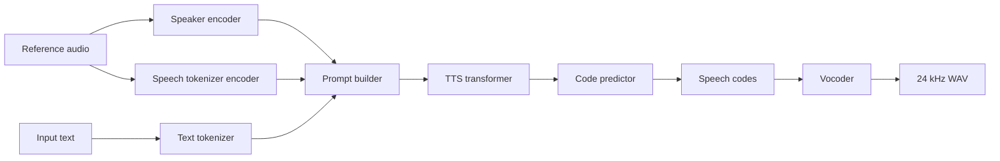

# qwen3-tts.cpp

Native C++17 / GGML inference for Qwen3-TTS.

This repository is a heavily developed fork of the original
[`predict-woo/qwen3-tts.cpp`](https://github.com/predict-woo/qwen3-tts.cpp).
The current codebase now provides a fuller local runtime for Qwen3-TTS:
GGUF model loading, text tokenization, speaker conditioning, autoregressive
speech-code generation, and 24 kHz waveform decoding without Python or PyTorch
at inference time.

The primary tested development target is Windows. Linux builds use the normal
CMake path and should work with the same GGML backend choices, but Linux
verification may lag behind Windows.

## Features

- End-to-end Qwen3-TTS inference in C++17
- GGML backend integration with CPU and optional CUDA builds
- 0.6B and 1.7B Base model support
- 1.7B CustomVoice model support
- Voice cloning from reference WAV files
- ICL voice cloning with reference transcript and optional reference speech codes
- Reusable speaker embeddings in JSON or raw float32 binary format
- Standalone speaker-embedding extraction with `--extract-speaker-embedding`
- Named CustomVoice speakers
- Style / instruction prompts where supported by the loaded model
- Language selection for `en`, `ru`, `zh`, `ja`, `ko`, `de`, `fr`, `es`, `it`, and `pt`
- Sampling controls: temperature, top-k, top-p, max tokens, repetition penalty
- GGUF quantization tooling for transformer weights, including Q8_0 and K-quant variants
- Native C++ API, C ABI, optional JNI target, and Kotlin wrapper sources
- WAV validation, regression-test scripts, trace dumps, and timing instrumentation

## Status

This project is actively evolving. The Windows CUDA path is the most exercised
configuration at the moment.

Quantized GGUF support is available for transformer models. Audio-critical
tokenizer/vocoder paths and embedding tables are intentionally kept in higher
precision by the quantization policy.

## Benchmarks

These numbers are local Windows CUDA measurements from the framework comparison
harness. Each row is the average of three voice-clone runs. Speaker encoding is
measured as a separate encode phase, and speech synthesis is measured with a
precomputed speaker embedding.

Test setup:

- Windows, CUDA backend, NVIDIA GeForce RTX 5080 Laptop GPU 16 GB
- `max_tokens=128`, `threads=4`, sampled decoding with temperature `0.9`,
  top-k `50`, top-p `1.0`, repetition penalty `1.05`
- `Speaker encode` is the standalone encode phase wall time
- `RTF` is computed from speech synthesis only: `audio seconds / synthesis seconds`
- Higher RTF is better

### 1.7B Base

| Engine | Model / dtype | Speaker encode | Speech synthesis | Audio | RTF |
|--------|---------------|----------------|------------------|-------|-----|
| `qwen3-tts.cpp` | GGUF F16 | 2.029 s | 1.503 s | 6.907 s | 4.600 |
| `ServeurpersoCom/qwentts.cpp` | GGUF Q8_0 | 2.035 s | 3.492 s | 6.960 s | 2.001 |
| `audio.cpp` | HF weights, F16 | 1.380 s | 5.888 s | 5.600 s | 0.953 |
| `faster-qwen3-tts` | HF weights, BF16 | 11.466 s | 17.832 s | 7.120 s | 0.401 |
| Official Python | HF weights, BF16 | 12.160 s | 22.550 s | 6.800 s | 0.303 |

### 0.6B Base

| Engine | Model / dtype | Speaker encode | Speech synthesis | Audio | RTF |
|--------|---------------|----------------|------------------|-------|-----|
| `qwen3-tts.cpp` | GGUF Q8_0 | 2.562 s | 1.104 s | 6.987 s | 6.345 |
| `ServeurpersoCom/qwentts.cpp` | GGUF Q8_0 | 2.002 s | 4.281 s | 9.280 s | 2.169 |
| `audio.cpp` | HF weights, F32 | 1.275 s | 5.777 s | 5.920 s | 1.025 |
| `faster-qwen3-tts` | HF weights, BF16 | 12.391 s | 17.358 s | 6.400 s | 0.369 |
| Official Python | HF weights, BF16 | 12.919 s | 23.348 s | 7.360 s | 0.315 |

For 0.6B, `audio.cpp` was benchmarked with F32 weights because its F16 run
failed with non-finite sampler logits on this setup.

The comparison harness is:

```powershell
.\scripts\benchmark_frameworks.ps1 -Variant 1.7b-base -BenchmarkMode split -Runs 3
.\scripts\benchmark_frameworks.ps1 -Variant 0.6b-base -BenchmarkMode split -Runs 3 `
  -QwenCppModelName qwen3-tts-0.6b-base-q8_0-reconverted.gguf
```

## Quick Start

### Windows

```powershell
git clone https://github.com/Danmoreng/qwen3-tts.cpp.git
cd qwen3-tts.cpp
git submodule update --init --recursive

# CPU build
.\build.ps1 -UseNinja -Configuration Release

# CUDA build
.\build.ps1 -UseNinja -EnableCuda -Configuration Release
```

Create a Python environment for model download/conversion only:

```powershell
uv venv .venv
.\.venv\Scripts\Activate.ps1
uv pip install --upgrade pip
uv pip install huggingface_hub gguf torch safetensors numpy tqdm
```

Download and convert models:

```powershell
python .\scripts\setup_pipeline_models.py
python .\scripts\setup_1.7b_model.py
```

Run synthesis:

```powershell
.\build\qwen3-tts-cli.exe -m .\models `
  -t "Hello from qwen3-tts.cpp running locally." `
  -o .\examples\hello.wav
```

### Linux

Linux uses the standard CMake build path:

```bash
git clone https://github.com/Danmoreng/qwen3-tts.cpp.git
cd qwen3-tts.cpp
git submodule update --init --recursive

cmake -S . -B build -DCMAKE_BUILD_TYPE=Release
cmake --build build -j
```

For CUDA builds, enable the GGML CUDA backend:

```bash
cmake -S . -B build-cuda \
  -DCMAKE_BUILD_TYPE=Release \
  -DQWEN3_TTS_CUDA=ON \
  -DGGML_CUDA=ON
cmake --build build-cuda -j
```

Model setup is the same as on Windows:

```bash
uv venv .venv
source .venv/bin/activate
uv pip install --upgrade pip
uv pip install huggingface_hub gguf torch safetensors numpy tqdm

python scripts/setup_pipeline_models.py
python scripts/setup_1.7b_model.py
```

Run synthesis:

```bash
./build/qwen3-tts-cli \
  -m models \
  -t "Hello from qwen3-tts.cpp running locally." \
  -o examples/hello.wav
```

## Model Files

The setup scripts create GGUF files under `models/`.

Typical files:

| File | Purpose |
|------|---------|
| `qwen3-tts-0.6b-f16.gguf` | 0.6B Base transformer |
| `qwen3-tts-1.7b-base-f16.gguf` | 1.7B Base transformer |
| `qwen3-tts-1.7b-customvoice-f16.gguf` | 1.7B CustomVoice transformer |
| `qwen3-tts-tokenizer-f16.gguf` | Speech tokenizer / vocoder |
| `qwen3-tts-*-q8_0.gguf` | Quantized transformer variant, if generated |
| `qwen3-tts-*-q4_k_m.gguf` | K-quant transformer variant, if generated |

Manual conversion is still available:

```bash
huggingface-cli download Qwen/Qwen3-TTS-12Hz-0.6B-Base \
  --local-dir models/Qwen3-TTS-12Hz-0.6B-Base

python scripts/convert_tts_to_gguf.py \
  models/Qwen3-TTS-12Hz-0.6B-Base \
  models/qwen3-tts-0.6b-f16.gguf

python scripts/convert_tokenizer_to_gguf.py \
  models/Qwen3-TTS-12Hz-0.6B-Base \
  models/qwen3-tts-tokenizer-f16.gguf
```

Quantize a converted transformer GGUF:

```bash
./build/qwen3-tts-quantize \
  models/qwen3-tts-1.7b-base-f16.gguf \
  models/qwen3-tts-1.7b-base-q8_0.gguf \
  q8_0
```

Supported output policies include `bf16`, `q8_0`, `q4_k`, `q4_k_m`,
`q5_k_m`, `q6_k`, and lower-bit K-quant variants.

## Usage

Basic synthesis:

```bash
./build/qwen3-tts-cli -m models \
  -t "Hello, world!" \
  -o hello.wav
```

Select a specific model:

```bash
./build/qwen3-tts-cli -m models \
  --model-name qwen3-tts-1.7b-base-f16.gguf \
  -t "The selected model is now running." \
  -o selected.wav
```

Voice cloning from reference audio:

```bash
./build/qwen3-tts-cli -m models \
  -r reference.wav \
  -t "This should follow the reference voice." \
  -o cloned.wav
```

ICL voice cloning with a reference transcript:

```bash
./build/qwen3-tts-cli -m models \
  -r reference.wav \
  --reference-text "Transcript of the reference audio." \
  -t "This uses the reference transcript as an acoustic prompt." \
  -o cloned_icl.wav
```

Extract a speaker embedding and synthesize from it later:

```bash
./build/qwen3-tts-cli -m models \
  -r reference.wav \
  --extract-speaker-embedding speaker.json

./build/qwen3-tts-cli -m models \
  --speaker-embedding speaker.json \
  -t "This run skips reference-audio speaker encoding." \
  -o cloned_from_embedding.wav
```

CustomVoice speaker:

```bash
./build/qwen3-tts-cli -m models \
  --model-name qwen3-tts-1.7b-customvoice-f16.gguf \
  --speaker vivian \
  --instruct "Whispering, very soft and quiet voice." \
  -t "This is a styled CustomVoice example." \
  -o styled.wav
```

Greedy decoding:

```bash
./build/qwen3-tts-cli -m models \
  -t "Hello!" \
  --temperature 0 \
  --top-k 0 \
  --max-tokens 256 \
  -o greedy.wav
```

## CLI Options

| Flag | Description | Default |
|------|-------------|---------|
| `-m, --model <dir>` | Directory containing GGUF model files | Required |
| `--model-name <file>` | Select a specific TTS GGUF in `--model` | Auto-detect |
| `-t, --text <text>` | Text to synthesize | Required except extraction mode |
| `-o, --output <file>` | Output WAV path | `output.wav` |
| `-r, --reference <file>` | Reference WAV for voice cloning | None |
| `--reference-text <text>` | Reference transcript for ICL voice cloning | None |
| `--reference-text-file <file>` | Read ICL transcript from a file | None |
| `--reference-token-ids <file>` | Reference prompt token IDs | None |
| `--reference-codes <file>` | Reference speech codes as text or JSON integers | None |
| `--speaker <name>` | Named CustomVoice speaker | None |
| `--speaker-embedding <file>` | Reuse saved speaker embedding | None |
| `--dump-speaker-embedding <file>` | Save embedding while running synthesis from `--reference` | None |
| `--extract-speaker-embedding <file>` | Extract speaker embedding from `--reference` and exit | None |
| `--dump-generated-codes <file>` | Save generated speech codes | None |
| `--dump-decoder-codes <file>` | Save vocoder-input speech codes | None |
| `--temperature <value>` | Sampling temperature; `0` means greedy | `0.9` |
| `--top-k <n>` | Top-k sampling; `0` disables it | `50` |
| `--top-p <value>` | Top-p sampling parameter | `1.0` |
| `--max-tokens <n>` | Maximum generated audio frames | `4096` |
| `--repeat <n>` | Repeat synthesis in one loaded process | `1` |
| `--repetition-penalty <value>` | Repetition penalty | `1.05` |
| `-l, --language <lang>` | `en ru zh ja ko de fr es it pt` | `en` |
| `--instruction`, `--instruct` | Style / voice instruction prompt | None |
| `-j, --threads <n>` | CPU thread count | `4` |

`--reference`, `--speaker`, and `--speaker-embedding` are mutually exclusive
speaker-conditioning modes.

## Architecture



Major runtime components:

| Component | Files | Role |
|-----------|-------|------|
| Text tokenizer | `src/text_tokenizer.*`, `src/tokenizer_unicode.*` | BPE tokenization |
| Speaker encoder | `src/audio_tokenizer_encoder.*`, `src/encoder/*` | Reference audio to speaker embedding |
| Speech tokenizer encoder | `src/speech_tokenizer_encoder.*` | Reference audio to speech codes for ICL/debugging |
| Transformer | `src/tts_transformer.*`, `src/transformer/*` | Talker and code-predictor generation |
| Vocoder | `src/audio_tokenizer_decoder.*`, `src/decoder/*` | Speech codes to waveform |
| Pipeline | `src/qwen3_tts.*`, `src/pipeline/*` | End-to-end orchestration, caching, timing |
| CLI | `src/main.cpp` | Command-line frontend |
| C API / JNI | `src/qwen3_tts_c.*`, `src/qwen3_tts_jni.cpp` | Native integration surface |

## Native APIs

The CLI is one frontend. The repository also exposes:

- C++ API: `qwen3_tts::Qwen3TTS` in `src/qwen3_tts.h`
- C ABI: `src/qwen3_tts_c.h`
- Optional JNI shared library with `-DQWEN3_TTS_BUILD_SHARED=ON`
- Kotlin Multiplatform wrapper sources under `shared/`

Build the JNI target:

```bash
cmake -S . -B build-shared -DQWEN3_TTS_BUILD_SHARED=ON
cmake --build build-shared -j
```

## Build Options

Common CMake options:

| Option | Purpose |
|--------|---------|
| `QWEN3_TTS_CUDA` | Enable GGML CUDA integration |
| `QWEN3_TTS_TIMING` | Enable detailed timing logs |
| `QWEN3_TTS_BUILD_SHARED` | Build optional JNI shared library |
| `QWEN3_TTS_EMBED_GGML` | Build GGML as a CMake subdirectory |
| `QWEN3_TTS_GGML_DIR` | Path to the GGML source tree |

Windows helper examples:

```powershell
.\build.ps1 -Configuration Release
.\build.ps1 -UseNinja -EnableCuda -EnableTiming -Configuration Release
```

CMake examples:

```bash
cmake -S . -B build -DCMAKE_BUILD_TYPE=Release
cmake --build build -j

cmake -S . -B build-timing \
  -DCMAKE_BUILD_TYPE=Release \
  -DQWEN3_TTS_TIMING=ON
cmake --build build-timing -j
```

Low-memory mode can be enabled at runtime:

```bash
QWEN3_TTS_LOW_MEM=1 ./build/qwen3-tts-cli -m models -t "Hello" -o hello.wav
```

## Testing and Debugging

Windows regression runner:

```powershell
.\scripts\run_all_tests.ps1 -Configuration Release
```

POSIX test runner:

```bash
bash scripts/run_all_tests.sh
```

Useful debugging tools:

| Tool | Purpose |
|------|---------|
| `scripts/prepare_test_assets.ps1` | Generate or refresh deterministic reference assets |
| `scripts/compare_e2e.py` | End-to-end Python vs C++ comparison |
| `scripts/dump_python_trace.py` | Dump Python logits/tokens for frame-level debugging |
| `scripts/debug_trace_report.py` | Compare trace directories |
| `scripts/wav_stats.ps1` | Validate WAV duration, peak, RMS, and silence checks |
| `QWEN3_TTS_DEBUG_DUMP_DIR` | Enable C++ frame/code trace dumps |
| `QWEN3_TTS_DEBUG_DUMP_MAX_FRAMES` | Limit dumped generation frames |
| `QWEN3_TTS_DEBUG_DUMP_MAX_CODE_STEPS` | Limit dumped code-predictor steps |

Example trace run:

```powershell
$env:QWEN3_TTS_DEBUG_DUMP_DIR = ".\trace_cpp"
$env:QWEN3_TTS_DEBUG_DUMP_MAX_FRAMES = "2"
$env:QWEN3_TTS_DEBUG_DUMP_MAX_CODE_STEPS = "15"

.\build\qwen3-tts-cli.exe -m .\models `
  --model-name qwen3-tts-1.7b-base-f16.gguf `
  -t "Hello." `
  --temperature 0 `
  --top-k 0 `
  --max-tokens 64 `
  -o trace.wav

python .\scripts\debug_trace_report.py --trace-a .\trace_cpp
```

## Acknowledgments

- Original fork base: [`predict-woo/qwen3-tts.cpp`](https://github.com/predict-woo/qwen3-tts.cpp)
- Qwen3-TTS models by the [Alibaba Qwen team](https://huggingface.co/Qwen)
- [GGML](https://github.com/ggml-org/ggml), the tensor/runtime foundation used by this project
- The wider llama.cpp / GGML community for backend, quantization, and runtime ideas

## License

This project's source code is released under the MIT License. See
[`LICENSE`](LICENSE).

Please review bundled dependency licenses and the Qwen3-TTS model licenses
before redistributing dependencies, model files, or generated artifacts.
